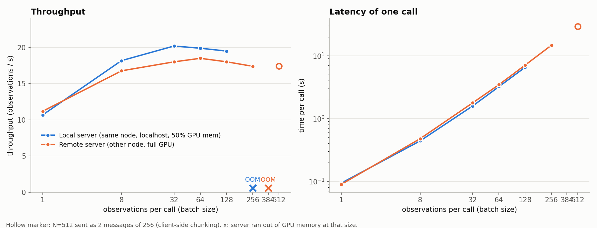

# Batched inference on the openpi server

`Policy.infer` handles one obs (it adds a batch dim of 1, transforms are per-sample, output is cut to `x[0]`), so a
pre-batched obs fails inside the transforms. Added a batched path (all in `third_party/openpi`):

- `Policy.infer_batch(obs_list)` (`src/openpi/policies/policy.py`): input transforms per sample -> stack -> ONE
  `sample_actions` call -> output transform per sample. Optional per-obs `"noise"` `(horizon, dim)`, all or none.
- Server (`serving/websocket_policy_server.py`): message `{"batch": [obs, ...]}` -> reply `{"batch": [result, ...]}`.
  Plain single-obs messages are unchanged.
- Client: `WebsocketClientPolicy.infer_batch(obs_list) -> list[dict]`.
- Test/benchmark: `scripts/test_pi_batch.py`.

## Batch-size sweep (up to the memory limit)
`scripts/bench_pi_batch.py` (dummy inputs: 2 x 224x224x3 uint8 images + proprio; median of 3 calls after a warm-up call
that includes the per-size JIT compile), plotted by `scripts/plot_pi_batch.py`; raw numbers in
`images/pi_batch_bench.json`. Model: pi05_droid_jointpos_polaris on an L40 (46 GB).

| N (obs/call) | local: call ms | local obs/s | remote: call ms | remote obs/s | remote model ms |
|---|---|---|---|---|---|
| 1 | 94 | 10.7 | 89 | 11.2 | 65 |
| 8 | 440 | 18.2 | 477 | 16.8 | 435 |
| 32 | 1584 | 20.2 | 1776 | 18.0 | 1651 |
| 64 | 3217 | 19.9 | 3459 | 18.5 | 3216 |
| 128 | 6563 | 19.5 | 7102 | 18.0 | 6605 |
| 256 | **OOM** | - | 14715 | 17.4 | 13681 |
| 384 | not tried | - | **OOM** | - | - |
| 512 | not tried | - | 29355 (2 msgs of 256) | 17.4 | 13601 per msg |

- **local** = server on the same node as the client (g3092, `localhost`), `XLA_PYTHON_CLIENT_MEM_FRACTION=0.5` (~23 GB
  to JAX). Deliberately not pushed past 128 (the OOM at 256 is the stopping point; one 8.1 GB allocation did not fit).
- **remote** = slurm job 40962176 on g3115 (`--host g3115`), whole GPU. OOM at 384 (one 36 GB allocation).

### Conclusions
- **Throughput is flat from N~8 upward (17-20 obs/s).** The model is compute-bound: ~50-55 ms per observation, linear in
  N. A bigger batch only raises latency, so there is no reason to go past a few dozen per call. N=1 -> N=8 is the only
  real gain (~1.7x).
- **Why you can't go arbitrarily large:** activations for the whole batch are allocated on the server GPU in a few big
  buffers. At 0.5 memory fraction that fails at N=256; with the full GPU it fails somewhere in 256-384.
  A single call of 512 does not fit on a 46 GB L40.
- **N=512 works by splitting:** `client.infer_batch(obs, max_batch_size=256)` sends 2 messages (server code unchanged).
  Result: 29.4 s per call = 17.4 obs/s, within 3% of the N=256 throughput. Chunk size only needs to be one that fits;
  keep it fixed, since each new batch size triggers a JIT recompile (20-100 s, longer for larger N).
- **Network cost is small.** Call time minus server-side model time: remote 24 ms (N=1), 0.5 s (N=128), 1.0 s (N=256),
  i.e. ~5-7% (images are ~300 KB per obs, so it is mostly (de)serialization). The local server isn't meaningfully
  faster; remote N=128 model time is also ~4% higher than local (6.6 s vs 6.3 s). The full GPU buys larger batches, not speed.
- **Implication for 512 envs:** one policy query for all envs costs ~29 s, so with `open_loop_horizon=8` the policy
  inference alone bounds the rollout at ~17 obs/s regardless of how fast the sim is. To go faster you need a faster
  model call (more GPUs/servers, fewer denoising steps, lower precision), not larger batches.
- `scripts/run_pi_parallel.py` now makes one `infer_batch` call per chunk step over a single connection (no thread pool).

## Gotchas
- JAX recompiles per batch size; keep N fixed (or pad to a few sizes). The first request compiles for minutes and blocks
  the server event loop, so clients must disable websocket keepalive (`ping_interval=None`) or they get a 1011 timeout (the vendored `WebsocketClientPolicy` now does this, but only when the installed `websockets` has those args, i.e. >= 13; Isaac Sim bundles 12.0, whose sync client sends no keepalive pings, so there is nothing to disable and passing them raised a `TypeError`).
- Running the server on a non-slurm node: `/gscratch` is read-only and `/root` has a ~5 GB quota (checkpoint is 12 GB;
  the download fails with "Disk quota exceeded" and leaves truncated files that later load as OUT_OF_RANGE). Use
  `OPENPI_DATA_HOME` on `/tmp`, `UV_CACHE_DIR=/root/.uv-cache`, and delete a partial `openpi-assets` dir before retrying.
- `pkill -f serve_policy` kills the calling shell if its command line contains that string; use `pkill -f "[s]erve_polic[y]"`.
