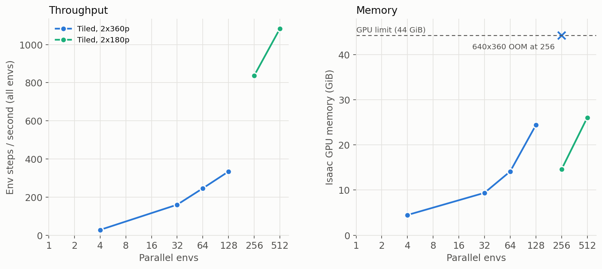

# Parallel-env benchmark (BananaBin, sim-evals env) — `scripts/bench_envs.py`

Measures GPU memory + env throughput vs `num_envs` with hold-pose actions (no policy server, no training loop).
One process per N (`--num-envs N [--drop-cam2] [--cam-scale 0.5]`); prints a `BENCH {json}` line. Isaac hangs at exit and
on renderer errors: the script ends with `os._exit(0)`, and when sweeping run each job detached with `timeout -s KILL`
and kill leftovers by PID. (Don't `pkill -f` a pattern that appears in your own shell command line.)

Hardware: L40 46 GB, 8 CPU cores. Env step = 8 physics substeps + 1 render of all cameras.

## Results (Isaac only; first 5 rows had the 23 GB openpi server on the same GPU, memory is the delta)
| cams | N | Isaac MiB | ms / step (all N) | env-steps/s |
|---|---|---|---|---|
| 3 x 720p | 1 | 4656 | 146 | 6.9 |
| 3 x 720p | 2 | 5294 | 158 | 12.6 |
| 3 x 720p | 4 | 6662 | 193 | 20.8 |
| 3 x 720p | 8 | 9417 | 268 | 29.9 |
| 3 x 720p | 16 | 14626 | 428 | 37.4 |
| 2 x 360p (cam2 dropped) | 1 | 4208 | 135 | 7.4 |
| 2 x 360p | 8 | 5034 | 192 | 41.8 |
| 2 x 360p | 16 | 6064 | 264 | 60.6 |
| 2 x 360p | 24 | 6894 | 345 | 69.7 |
| 2 x 360p | 28, 32, 48, 64, 128 | **fails** | | |

## Key finding: the limit is the renderer, not VRAM
N=28+ (>= 56 cameras) fails at ~7-10 GB used with `[gpu.foundation.plugin] Unable to allocate descriptor sets` /
`Failed to allocate ParameterBlock resources`, then hangs (GPU util ~1%). 48 cameras works (16 envs x 3 cams, 24 x 2),
56 does not, so the cap is ~48-55 `CameraCfg` render products (one per camera per env), independent of resolution/memory.
Max envs with the current setup: 16 (3 cams) / 24 (2 cams, cam2 dropped) — about 70 env-steps/s, ~9x the single env.

## Tiled cameras lift the cap (`bench_envs.py --tiled`)
`TiledCameraCfg` renders all envs of a camera into one batched render product, so the ~48-camera cap disappears.
`--tiled` converts the scene's `CameraCfg`s on the fly (same prim path/spawn/offset; `simeval_droid.py` itself is unchanged
so far). Empty GPU (no pi server), `external_cam_2` dropped:
| cam res | N | Isaac MiB | ms / step (all N) | env-steps/s |
|---|---|---|---|---|
| 640x360 | 4 | 4587 | 143 | 28.0 |
| 640x360 | 32 | 9618 | 200 | 160 |
| 640x360 | 64 | 14474 | 260 | 246 |
| 640x360 | 128 | 24996 | 383 | 334 |
| 640x360 | 256 | **OOM** (44.3 GiB) | | |
| 320x180 | 256 | 14946 | 306 | **837** |
| 320x180 | 512 | 26689 | 473 | **1083** |
(~0.05 GB/env at 320x180 above a ~2-3 GB base; 1024 would extrapolate to ~50 GB, so ~700-800 is the memory ceiling; throughput gains are flattening: 256 -> 512 gives only +30%.)
- Tiled memory is ~0.16 GB/env at 640x360 and scales mostly with camera resolution; 320x180 still exceeds the 224x224 the
  policy sees, so little information is lost, but images will differ slightly from the 720p path (check visually / eval
  before training: distribution shift vs the pretrained policy).
- Scene build gets slow at large N (~3 min for 128-256 envs, mostly asset instantiation).
- Still env-only, hold-pose. Training loop remains single-env.

## To go further
- Use Isaac Lab `TiledCameraCfg` (one render product for all envs) instead of `CameraCfg`; the obs `mdp.observations.image`
  term works with it. This is the route to 64-256 envs.
- Per-env cost with 2 x 360p is ~0.1 GB, so memory would allow hundreds of envs once the camera cap is gone.
- Throughput saturates well before the cap (render/physics bound), and `external_cam_2` is unused by the policy client.
- Training loop is still single-env (`num_envs=1` hard-coded, obs terms index env 0); see the plan for vectorizing.

## Context: why this was measured
`scripts/train_steering.py` collects data with one env, one chunk at a time (blocking openpi query -> 8 env steps -> next
query), ~0.86 chunks/s on BananaBin with the original cameras (single-env `step_ms` ~145). Goal: find how many parallel
envs fit on one GPU, and whether moving the openpi server to another GPU helps.

## GPU memory budget (L40, 46 GB)
- openpi pi0.5 server held ~23 GB (`XLA_PYTHON_CLIENT_MEM_FRACTION=0.5` preallocates; actual need is much lower), leaving
  ~22 GB for Isaac. Offloading the server (or lowering the fraction) frees that. Memory was not the binding constraint:
  Isaac used only 6-15 GB at N=16-24, so offloading the server doesn't raise N_max by itself (the camera cap does).
- Per-env cost: ~0.7 GB (3 x 720p cams), ~0.1 GB (2 x 360p, cam2 dropped).
- Scene has 3 `CameraCfg` cameras at 1280x720 (`external_cam`, `external_cam_2`, `wrist_cam`, `simeval_droid.py:51-96`),
  all rendered every step then resized to 224. `external_cam_2` is unused by `SimEvalsJointPosClient`.
  `bench_envs.py --drop-cam2 --cam-scale 0.5` emulates removing it / halving resolution.

## Blockers to num_envs > 1 in the training loop: resolved
The trainer is now parallel PPO (see [steering_training.md](steering_training.md)). Obs terms `arm_joint_pos` /
`gripper_pos` return all envs (N, ·). `SimEvalsJointPosClient` has a batched `build_requests`, and the client batches
server queries (`query_chunks` → `infer_batch`). `VecSimEvalsTask` / `VecChunkEnv` handle per-env episodes, and
`make_parallel_env` (`environments/simeval_parallel.py`) builds the tiled-camera env for both `run_pi_parallel.py` and
the trainer.

## Not measured yet
- openpi server latency / queries-per-second vs concurrency (likely the next bottleneck; a pi0 server is up on slurm job
  40962176, port 8000). Remote-host latency is also unmeasured.
- Any N > 24, or N > 16 at original cameras: blocked by the camera cap above.
- Whether `TiledCameraCfg` lifts the cap and what it does to throughput.

## Suggested order
1. Time the openpi server (queries/s at 1/4/16 concurrent clients).
2. Try `TiledCameraCfg` in `bench_envs.py` to see how far N can go.
3. Vectorize `ChunkEnv` + the train loop (items 1-6 above), keeping N=1 behaviour identical.

(regenerate: `isaacpy scripts/plot_bench_results.py`)
