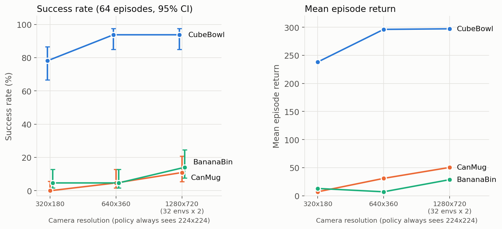

# Remote openpi server probe + camera-resolution sweep

Companion to [parallel_envs_bench.md](parallel_envs_bench.md) (env-only throughput). Scripts: `scripts/bench_server.py`
(dummy inputs, no env) and `scripts/run_pi_parallel.py` (many tiled-camera envs, one websocket per env).
Setup: Isaac envs on node g3097 (L40), openpi server on another node (g3115:8000, slurm job 40962176; metadata is empty so the
exact policy config is unknown to the client — user described it as pi0).

## 1. Server (`isaacpy scripts/bench_server.py --host g3115`)
- **Inference ~88 ms/query** (server-reported `infer_ms`); round trip 91 ms for the usual 224x224 inputs, so the network hop
  adds only ~3 ms. Output `actions` shape (15, 8). Passing `noise` (15,32) costs nothing extra.
- **No batching:** a request with a leading batch dim (B=2, 4) is rejected (`Error in inference server`, raised in
  `websocket_policy_server._handler` -> `policy.infer`). One observation per request.
- **No concurrency:** the server processes requests one at a time. Aggregate throughput is flat at **~11.3 queries/s** for 1-64
  clients while per-query latency grows linearly (N clients -> ~N x 90 ms): 8 clients 0.70 s, 16: 1.4 s, 32: 2.8 s, 64: 5.7 s.
- **Input size** (client-side images; the server resizes to 224 anyway): 224x224 0.29 MiB 91 ms; 360x640 1.3 MiB 104 ms;
  720x1280 5.3 MiB 148 ms. So always downsize to 224x224 before sending (`build_request` / `make_request` already do).
- Consequence: with one server, N envs get one chunk every N/11.3 s. 64 envs -> ~5.7 s per 8-step chunk round (the full
  450-step episode took ~10 min). Matching 256-512 envs needs ~25-50x the throughput: several server replicas (each ~11 q/s,
  load-balanced across ports/GPUs) and/or modifying openpi to batch (`policy.infer` + the transforms assume unbatched inputs).
  GPU utilization on the server is likely low for B=1, so batching is where the real win would be (untested).

## 2. Resolution sweep (`run_pi_parallel.py`, 64 episodes per cell, 1 episode = 450 steps / 30 s, tiled cams, cam2 dropped)
Camera resolution given to Isaac; the policy always sees 224x224 (`resize_with_pad`). Return = env reward summed over the
episode (success + hover-shaping terms; compare across columns within a task, not across tasks). Success = success term fired.

| task | 320x180 | 640x360 | 1280x720 (max) |
|---|---|---|---|
| CubeBowl success | 78.1% (50/64) | 93.8% (60/64) | 93.8% (60/64) |
| CubeBowl mean return | 238.2 | 296.3 | 297.3 |
| CanMug success | 0.0% (0/64) | 4.7% (3/64) | 10.9% (7/64) |
| CanMug mean return | 7.0 | 30.9 | 50.4 |
| BananaBin success | 4.7% (3/64) | 4.7% (3/64) | 14.1% (9/64) |
| BananaBin mean return | 12.9 | 7.0 | 28.6 |

- 1280x720 at 64 envs **OOMs** (44.3 GiB); the max-res column was run as 32 envs x 2 rounds (still 64 episodes; ~29 GB for 32 envs).
- Takeaway: 320x180 hurts (CubeBowl -16 pts; CanMug 0%). 640x360 matches max res on CubeBowl. On the two hard tasks success is
  low everywhere and rises with resolution (CanMug 0 -> 5 -> 11%, BananaBin 5 -> 5 -> 14%), but those counts are small
  (3-9 of 64; 95% CI roughly +-5-9 pts), so only the CubeBowl 320x180 drop and the CanMug 0% vs 11% gap are clearly beyond noise.
- Layout is fixed (no initial-condition randomization): episodes differ only by policy noise / physics, not scene variation.
- Per-run wall time: ~10 min for 64 envs at <=640x360 (server bound, one server); ~14 min for 32x2 at max res.
- Raw outputs: `runs/res_sweep/<Task>_s<scale>/{summary.json,all_cams.png,*.mp4}` (scale 0.25/0.5/1.0).

## Gotchas
- Isaac hangs on renderer errors and OOM: run sweeps detached (`setsid ... < /dev/null`), poll for `summary.json`, kill by PID.
- `NGX isn't enabled` log lines are harmless; match on `Traceback` / `out of memory` / `Failed to allocate` instead of `Error`.
- Test whether a host is reachable from the compute node you are on; a server on node A is not on `localhost` of node B.

(regenerate: `isaacpy scripts/plot_bench_results.py`)
